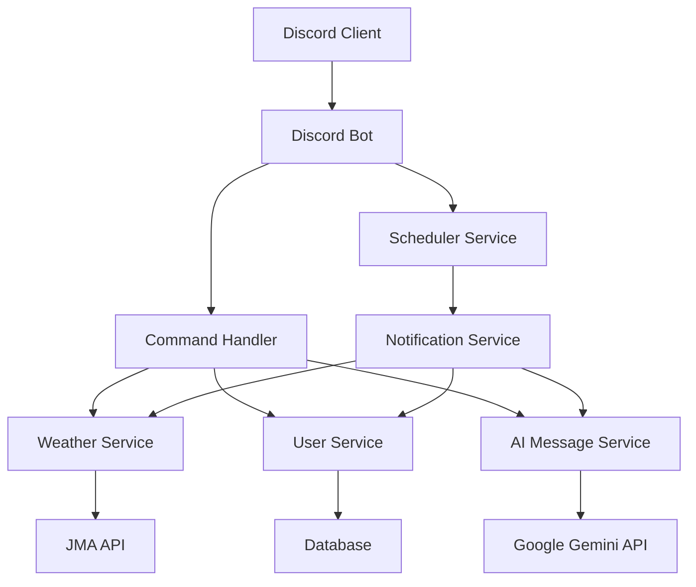

# Design Document

## Overview

Discord 天気情報ボットは、日本の気象庁 API を使用してリアルタイムの天気情報を提供し、ユーザーに定時で DM 通知を送信する Discord ボットです。Google Gemini AI を活用してポジティブなメッセージを生成し、ユーザーの位置情報をデータベースに保存して個人化されたサービスを提供します。

## Architecture

### システム構成図



### 技術スタック

- **プログラミング言語**: Python 3.9+
- **Discord ライブラリ**: discord.py
- **データベース**: SQLite (開発) / PostgreSQL (本番)
- **ORM**: SQLAlchemy
- **スケジューラー**: APScheduler
- **HTTP クライアント**: aiohttp
- **AI サービス**: Google Gemini API
- **天気データ**: 気象庁 API

## Components and Interfaces

### 1. Discord Bot Core (`bot.py`)

```python
class WeatherBot:
    def __init__(self):
        self.intents = discord.Intents.default()
        self.intents.message_content = True
        self.client = commands.Bot(command_prefix='/', intents=self.intents)

    async def setup_hook(self):
        # コマンド登録とサービス初期化
        pass
```

### 2. Weather Service (`services/weather_service.py`)

```python
class WeatherService:
    BASE_URL = "https://www.jma.go.jp/bosai"

    async def get_api_contents(self) -> Dict:
        # APIの利用可能なコンテンツ情報を取得
        url = f"{self.BASE_URL}/common/const/contents.json"
        # 天気予報、警報・注意報などの利用可能なサービス一覧
        pass

    async def get_area_list(self) -> Dict[str, AreaInfo]:
        # 地域情報を取得 (area.json)
        url = f"{self.BASE_URL}/common/const/area.json"
        # 地域コード、地域名、親地域の情報を返す
        pass
        
    async def get_major_cities(self) -> Dict[str, List[AreaInfo]]:
        # 主要都市のリストを地域別に取得
        # 地域ごとにグループ化された主要都市情報を返す
        pass

    async def get_current_weather(self, area_code: str) -> WeatherData:
        # 気象庁APIから現在の天気を取得
        # forecast コンテンツタイプを使用
        url = f"{self.BASE_URL}/forecast/data/forecast/{area_code}.json"
        pass

    async def get_forecast(self, area_code: str, days: int = 7) -> List[ForecastData]:
        # 気象庁APIから天気予報を取得（最大7日間）
        # forecast コンテンツタイプを使用
        url = f"{self.BASE_URL}/forecast/data/forecast/{area_code}.json"
        pass

    async def get_weather_alerts(self, area_code: str) -> List[AlertData]:
        # 気象警報・注意報を取得
        # warning コンテンツタイプ（bousai グループ）を使用
        url = f"{self.BASE_URL}/warning/data/warning/{area_code}.json"
        pass

    async def search_area_by_name(self, area_name: str) -> List[AreaInfo]:
        # 地域名から地域コードを検索
        # かな名、漢字名、英語名での検索をサポート
        pass
```

### 3. User Service (`services/user_service.py`)

```python
class UserService:
    async def set_user_location(self, user_id: int, area_code: str, area_name: str):
        # ユーザーの位置情報をデータベースに保存
        pass

    async def get_user_location(self, user_id: int) -> Optional[UserLocation]:
        # ユーザーの保存された位置情報を取得
        pass

    async def set_notification_schedule(self, user_id: int, hour: int):
        # 通知スケジュールを設定（0-23時で指定）
        pass

    async def disable_notifications(self, user_id: int):
        # 通知を無効化
        pass
```

### 4. AI Message Service (`services/ai_service.py`)

```python
class AIMessageService:
    async def generate_positive_message(self, weather_data: WeatherData) -> str:
        # Google Gemini APIを使用してポジティブなメッセージを生成
        pass
```

### 5. Notification Service (`services/notification_service.py`)

```python
class NotificationService:
    async def send_scheduled_weather_update(self, user_id: int):
        # 定時天気情報をDMで送信
        pass

    async def schedule_notifications(self):
        # 全ユーザーの通知スケジュールを管理
        pass
```

### 6. Command Handlers (`commands/`)

#### Weather Commands (`commands/weather_commands.py`)

- `/weather [location]` - 現在の天気情報を取得
- `/forecast [location]` - 5 日間の天気予報を取得
- `/weather-alerts [location]` - 気象警報・注意報を取得
- `/locations` - 主要都市のリストを表示

#### User Commands (`commands/user_commands.py`)

- `/set-location <area>` - ユーザーの位置を設定
- `/schedule-weather <hour>` - 定時通知を設定（0-23 時で指定）
- `/unschedule-weather` - 定時通知を停止
- `/my-settings` - ユーザー設定を表示

#### Admin Commands (`commands/admin_commands.py`)

- `/weather-config` - サーバー設定

## Data Models

### User Model

```python
class User(Base):
    __tablename__ = 'users'

    id = Column(Integer, primary_key=True)
    discord_id = Column(BigInteger, unique=True, nullable=False)
    area_code = Column(String(10))
    area_name = Column(String(100))
    notification_hour = Column(Integer)  # 0-23時で通知時間を指定
    timezone = Column(String(50), default='Asia/Tokyo')
    is_notification_enabled = Column(Boolean, default=False)
    created_at = Column(DateTime, default=datetime.utcnow)
    updated_at = Column(DateTime, default=datetime.utcnow, onupdate=datetime.utcnow)
```

### Weather Data Models

```python
@dataclass
class AreaInfo:
    code: str
    name: str
    en_name: str
    kana: str
    parent: str
    prefecture: Optional[str] = None
    region: Optional[str] = None

@dataclass
class WeatherData:
    area_name: str
    area_code: str
    weather_code: str
    weather_description: str
    wind: str
    wave: str
    temperature: Optional[float]
    precipitation_probability: int
    timestamp: datetime
    publish_time: datetime

@dataclass
class ForecastData:
    date: date
    weather_code: str
    weather_description: str
    temp_min: Optional[float]
    temp_max: Optional[float]
    temp_min_upper: Optional[float]
    temp_min_lower: Optional[float]
    temp_max_upper: Optional[float]
    temp_max_lower: Optional[float]
    precipitation_probability: int
    reliability: str

@dataclass
class AlertData:
    title: str
    description: str
    severity: str
    issued_at: datetime
    area_codes: List[str]
```

## Error Handling

### API エラー処理

1. **気象庁 API エラー**

   - レート制限: 指数バックオフで再試行
   - サービス停止: キャッシュされたデータを使用
   - 無効な地域コード: ユーザーに適切なエラーメッセージを表示

2. **Google Gemini API エラー**

   - API 制限: デフォルトのポジティブメッセージを使用
   - 接続エラー: 天気情報のみを提供

3. **データベース エラー**
   - 接続失敗: 一時的なメモリストレージを使用
   - データ整合性エラー: ログ記録とユーザー通知

### Discord API エラー処理

1. **権限エラー**: ユーザーに権限不足を通知
2. **メッセージ送信失敗**: 再試行とログ記録
3. **レート制限**: 自動的な遅延処理

## Testing Strategy

### 1. Unit Tests

- **Weather Service**: 気象庁 API のモック化テスト
- **User Service**: データベース操作のテスト
- **AI Service**: Google Gemini API のモック化テスト
- **Command Handlers**: Discord コマンドの動作テスト

### 2. Integration Tests

- **API 統合**: 実際の API エンドポイントとの統合テスト
- **データベース統合**: 実際のデータベースとの統合テスト
- **Discord 統合**: テスト用 Discord サーバーでの動作確認

### 3. End-to-End Tests

- **コマンド実行フロー**: ユーザーがコマンドを実行してから結果を受信するまでの全体フロー
- **定時通知フロー**: スケジュールされた通知の送信テスト
- **エラーハンドリング**: 各種エラー状況での適切な応答テスト

### 4. Performance Tests

- **API 応答時間**: 気象庁 API と Google Gemini API の応答時間測定
- **データベースクエリ**: 大量ユーザー時のクエリパフォーマンス
- **メモリ使用量**: 長時間稼働時のメモリリーク検出

### テストデータ

- **モック天気データ**: 様々な天気条件のテストデータ
- **テストユーザー**: 異なる設定を持つテストユーザーアカウント
- **エラーシナリオ**: API 障害、ネットワーク障害などのシミュレーション
