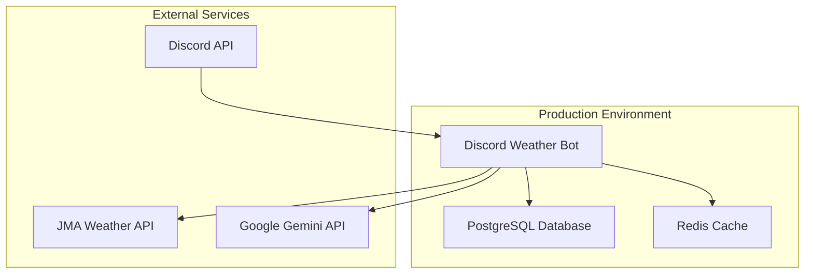

# Discord Weather Bot デプロイメントガイド 🚀

このガイドでは、Discord Weather Botを本番環境にデプロイする方法について詳しく説明します。

## 📋 目次

1. [デプロイメント概要](#デプロイメント概要)
2. [本番環境の要件](#本番環境の要件)
3. [Docker Compose デプロイメント](#docker-compose-デプロイメント)
4. [クラウドデプロイメント](#クラウドデプロイメント)
5. [環境変数の設定](#環境変数の設定)
6. [セキュリティ設定](#セキュリティ設定)
7. [監視とログ管理](#監視とログ管理)
8. [バックアップとリストア](#バックアップとリストア)
9. [CI/CD パイプライン](#cicd-パイプライン)
10. [トラブルシューティング](#トラブルシューティング)

## デプロイメント概要

### アーキテクチャ



### デプロイメント方式

1. **Docker Compose** (推奨) - シンプルな単一サーバーデプロイ
2. **Kubernetes** - スケーラブルなクラスターデプロイ
3. **クラウドサービス** - AWS ECS、Google Cloud Run等

## 本番環境の要件

### システム要件

#### 最小要件
- **CPU**: 1 vCPU
- **メモリ**: 1GB RAM
- **ストレージ**: 10GB SSD
- **ネットワーク**: 安定したインターネット接続

#### 推奨要件
- **CPU**: 2 vCPU
- **メモリ**: 2GB RAM
- **ストレージ**: 20GB SSD
- **ネットワーク**: 高速・安定したインターネット接続

### ソフトウェア要件

- **OS**: Ubuntu 20.04 LTS / CentOS 8 / Amazon Linux 2
- **Docker**: 20.10+
- **Docker Compose**: 2.0+
- **Git**: 2.0+

### ネットワーク要件

#### 必要なアウトバウンド接続
- **Discord API**: `discord.com:443`
- **気象庁API**: `www.jma.go.jp:443`
- **Google Gemini API**: `generativelanguage.googleapis.com:443`
- **Docker Hub**: `registry-1.docker.io:443`

#### ファイアウォール設定
```bash
# UFW の場合
sudo ufw allow out 443/tcp
sudo ufw allow out 80/tcp
sudo ufw allow out 53/udp  # DNS

# iptables の場合
sudo iptables -A OUTPUT -p tcp --dport 443 -j ACCEPT
sudo iptables -A OUTPUT -p tcp --dport 80 -j ACCEPT
sudo iptables -A OUTPUT -p udp --dport 53 -j ACCEPT
```

## Docker Compose デプロイメント

### 1. サーバーの準備

#### Ubuntu/Debian の場合
```bash
# システムの更新
sudo apt update && sudo apt upgrade -y

# 必要なパッケージのインストール
sudo apt install -y curl git ufw

# Docker のインストール
curl -fsSL https://get.docker.com -o get-docker.sh
sudo sh get-docker.sh
sudo usermod -aG docker $USER

# Docker Compose のインストール
sudo curl -L "https://github.com/docker/compose/releases/latest/download/docker-compose-$(uname -s)-$(uname -m)" -o /usr/local/bin/docker-compose
sudo chmod +x /usr/local/bin/docker-compose

# 再ログインまたは新しいシェルを開始
newgrp docker
```

#### CentOS/RHEL の場合
```bash
# システムの更新
sudo yum update -y

# 必要なパッケージのインストール
sudo yum install -y curl git firewalld

# Docker のインストール
curl -fsSL https://get.docker.com -o get-docker.sh
sudo sh get-docker.sh
sudo systemctl start docker
sudo systemctl enable docker
sudo usermod -aG docker $USER

# Docker Compose のインストール
sudo curl -L "https://github.com/docker/compose/releases/latest/download/docker-compose-$(uname -s)-$(uname -m)" -o /usr/local/bin/docker-compose
sudo chmod +x /usr/local/bin/docker-compose
```

### 2. プロジェクトのデプロイ

```bash
# プロジェクトのクローン
git clone <repository-url> /opt/discord-weather-bot
cd /opt/discord-weather-bot

# 権限の設定
sudo chown -R $USER:$USER /opt/discord-weather-bot
chmod +x scripts/*.sh

# 環境変数の設定
cp .env.example .env
nano .env  # 本番環境の設定を入力

# データディレクトリの作成（名前付きボリュームを使用するため不要）
# mkdir -p data logs
# chmod 755 data logs

# デプロイスクリプトの実行
./scripts/deploy.sh
```

### 3. 本番環境用 Docker Compose 設定

```yaml
# docker-compose.prod.yml
version: '3.8'

services:
  weather-bot:
    build: .
    container_name: weather-bot-prod
    restart: unless-stopped
    environment:
      - ENVIRONMENT=production
    env_file:
      - .env
    volumes:
      - ./data:/app/data
      - ./logs:/app/logs
    depends_on:
      - db
      - redis
    networks:
      - weather-bot-network
    deploy:
      resources:
        limits:
          memory: 1G
          cpus: '1.0'
        reservations:
          memory: 512M
          cpus: '0.5'
    healthcheck:
      test: ["CMD", "python", "-c", "import requests; requests.get('http://localhost:8080/health', timeout=5)"]
      interval: 30s
      timeout: 10s
      retries: 3
      start_period: 40s

  db:
    image: postgres:15-alpine
    container_name: weather-bot-db-prod
    restart: unless-stopped
    environment:
      POSTGRES_DB: weather_bot
      POSTGRES_USER: weather_user
      POSTGRES_PASSWORD: ${DB_PASSWORD}
    volumes:
      - postgres_data:/var/lib/postgresql/data
      - ./init.sql:/docker-entrypoint-initdb.d/init.sql
    networks:
      - weather-bot-network
    deploy:
      resources:
        limits:
          memory: 512M
          cpus: '0.5'
    healthcheck:
      test: ["CMD-SHELL", "pg_isready -U weather_user -d weather_bot"]
      interval: 30s
      timeout: 10s
      retries: 5

  redis:
    image: redis:7-alpine
    container_name: weather-bot-redis-prod
    restart: unless-stopped
    command: redis-server --appendonly yes --requirepass ${REDIS_PASSWORD}
    volumes:
      - redis_data:/data
    networks:
      - weather-bot-network
    deploy:
      resources:
        limits:
          memory: 256M
          cpus: '0.25'
    healthcheck:
      test: ["CMD", "redis-cli", "--raw", "incr", "ping"]
      interval: 30s
      timeout: 10s
      retries: 3

  nginx:
    image: nginx:alpine
    container_name: weather-bot-nginx-prod
    restart: unless-stopped
    ports:
      - "80:80"
      - "443:443"
    volumes:
      - ./nginx.conf:/etc/nginx/nginx.conf
      - ./ssl:/etc/nginx/ssl
    depends_on:
      - weather-bot
    networks:
      - weather-bot-network

volumes:
  postgres_data:
  redis_data:

networks:
  weather-bot-network:
    driver: bridge
```

### 4. 本番環境での起動

```bash
# 本番環境での起動
docker compose -f docker-compose.prod.yml up -d

# サービス状態の確認
docker compose -f docker-compose.prod.yml ps

# ログの確認
docker compose -f docker-compose.prod.yml logs -f weather-bot

# 注意: 新しいDocker Composeでは「docker compose」（スペース区切り）を使用します
# 古いバージョンでは「docker-compose」（ハイフン区切り）を使用します
```

## クラウドデプロイメント

### AWS ECS でのデプロイ

#### 1. ECS タスク定義

```json
{
  "family": "discord-weather-bot",
  "networkMode": "awsvpc",
  "requiresCompatibilities": ["FARGATE"],
  "cpu": "512",
  "memory": "1024",
  "executionRoleArn": "arn:aws:iam::ACCOUNT:role/ecsTaskExecutionRole",
  "taskRoleArn": "arn:aws:iam::ACCOUNT:role/ecsTaskRole",
  "containerDefinitions": [
    {
      "name": "weather-bot",
      "image": "your-account.dkr.ecr.region.amazonaws.com/discord-weather-bot:latest",
      "essential": true,
      "environment": [
        {
          "name": "ENVIRONMENT",
          "value": "production"
        }
      ],
      "secrets": [
        {
          "name": "DISCORD_TOKEN",
          "valueFrom": "arn:aws:secretsmanager:region:account:secret:discord-token"
        },
        {
          "name": "GEMINI_API_KEY",
          "valueFrom": "arn:aws:secretsmanager:region:account:secret:gemini-api-key"
        }
      ],
      "logConfiguration": {
        "logDriver": "awslogs",
        "options": {
          "awslogs-group": "/ecs/discord-weather-bot",
          "awslogs-region": "us-east-1",
          "awslogs-stream-prefix": "ecs"
        }
      }
    }
  ]
}
```

#### 2. RDS データベースの設定

```bash
# RDS PostgreSQL インスタンスの作成
aws rds create-db-instance \
    --db-instance-identifier weather-bot-db \
    --db-instance-class db.t3.micro \
    --engine postgres \
    --engine-version 15.4 \
    --master-username weather_user \
    --master-user-password your-secure-password \
    --allocated-storage 20 \
    --vpc-security-group-ids sg-xxxxxxxxx \
    --db-subnet-group-name your-subnet-group
```

### Google Cloud Run でのデプロイ

#### 1. Dockerfile の最適化

```dockerfile
# Dockerfile.prod
FROM python:3.12-slim

WORKDIR /app

# システムの依存関係をインストール
RUN apt-get update && apt-get install -y \
    gcc \
    && rm -rf /var/lib/apt/lists/*

# Python の依存関係をインストール
COPY requirements.txt .
RUN pip install --no-cache-dir -r requirements.txt

# アプリケーションコードをコピー
COPY src/ ./src/
COPY alembic/ ./alembic/
COPY alembic.ini .

# 非rootユーザーを作成
RUN useradd --create-home --shell /bin/bash app
USER app

# ヘルスチェック用のエンドポイント
EXPOSE 8080

CMD ["python", "src/bot.py"]
```

#### 2. Cloud Run へのデプロイ

```bash
# Google Cloud SDK の設定
gcloud config set project your-project-id

# Container Registry にイメージをプッシュ
docker build -f Dockerfile.prod -t gcr.io/your-project-id/discord-weather-bot .
docker push gcr.io/your-project-id/discord-weather-bot

# Cloud Run サービスのデプロイ
gcloud run deploy discord-weather-bot \
    --image gcr.io/your-project-id/discord-weather-bot \
    --platform managed \
    --region us-central1 \
    --memory 1Gi \
    --cpu 1 \
    --set-env-vars ENVIRONMENT=production \
    --set-secrets DISCORD_TOKEN=discord-token:latest \
    --set-secrets GEMINI_API_KEY=gemini-api-key:latest
```

## 環境変数の設定

### 本番環境用 .env ファイル

```bash
# Discord Bot 設定
DISCORD_TOKEN=your_production_discord_token
DISCORD_GUILD_ID=  # 本番では空にしてグローバルコマンドを使用

# データベース設定
DATABASE_URL=postgresql://weather_user:secure_password@db:5432/weather_bot
DB_PASSWORD=secure_database_password

# Redis 設定
REDIS_URL=redis://:secure_redis_password@redis:6379/0
REDIS_PASSWORD=secure_redis_password

# API キー
GEMINI_API_KEY=your_production_gemini_api_key

# ログ設定
LOG_LEVEL=INFO
LOG_FILE=/app/logs/weather_bot.log

# セキュリティ設定
SECRET_KEY=your_very_secure_secret_key_here

# 環境識別
ENVIRONMENT=production

# 監視設定
HEALTH_CHECK_PORT=8080
METRICS_PORT=9090
```

### 環境変数の管理

#### AWS Systems Manager Parameter Store
```bash
# パラメータの設定
aws ssm put-parameter \
    --name "/discord-weather-bot/discord-token" \
    --value "your_discord_token" \
    --type "SecureString"

aws ssm put-parameter \
    --name "/discord-weather-bot/gemini-api-key" \
    --value "your_gemini_api_key" \
    --type "SecureString"
```

#### Docker Secrets
```bash
# Docker Swarm でのシークレット管理
echo "your_discord_token" | docker secret create discord_token -
echo "your_gemini_api_key" | docker secret create gemini_api_key -
```

## セキュリティ設定

### 1. ファイアウォール設定

```bash
# UFW での基本設定
sudo ufw default deny incoming
sudo ufw default allow outgoing
sudo ufw allow ssh
sudo ufw allow 80/tcp
sudo ufw allow 443/tcp
sudo ufw enable
```

### 2. SSL/TLS 証明書の設定

#### Let's Encrypt を使用
```bash
# Certbot のインストール
sudo apt install certbot python3-certbot-nginx

# 証明書の取得
sudo certbot --nginx -d your-domain.com

# 自動更新の設定
sudo crontab -e
# 以下を追加
0 12 * * * /usr/bin/certbot renew --quiet
```

### 3. Docker セキュリティ

```bash
# Docker デーモンの設定
sudo mkdir -p /etc/docker
sudo tee /etc/docker/daemon.json <<EOF
{
  "log-driver": "json-file",
  "log-opts": {
    "max-size": "10m",
    "max-file": "3"
  },
  "live-restore": true,
  "userland-proxy": false,
  "no-new-privileges": true
}
EOF

sudo systemctl restart docker
```

### 4. データベースセキュリティ

```sql
-- PostgreSQL セキュリティ設定
-- 不要なデータベースの削除
DROP DATABASE IF EXISTS template0;

-- ユーザー権限の制限
REVOKE ALL ON SCHEMA public FROM PUBLIC;
GRANT USAGE ON SCHEMA public TO weather_user;
GRANT CREATE ON SCHEMA public TO weather_user;

-- 接続制限
ALTER USER weather_user CONNECTION LIMIT 10;
```

## 監視とログ管理

### 1. ログ設定

#### Logrotate の設定
```bash
# /etc/logrotate.d/discord-weather-bot
/opt/discord-weather-bot/logs/*.log {
    daily
    missingok
    rotate 30
    compress
    delaycompress
    notifempty
    create 644 root root
    postrotate
        docker-compose -f /opt/discord-weather-bot/docker-compose.prod.yml restart weather-bot
    endscript
}
```

### 2. 監視スクリプト

```bash
#!/bin/bash
# /opt/discord-weather-bot/scripts/health-check.sh

# ヘルスチェック
check_health() {
    local service=$1
    local status=$(docker-compose -f /opt/discord-weather-bot/docker-compose.prod.yml ps -q $service)
    
    if [ -z "$status" ]; then
        echo "ERROR: $service is not running"
        return 1
    fi
    
    local health=$(docker inspect --format='{{.State.Health.Status}}' $status 2>/dev/null)
    if [ "$health" != "healthy" ]; then
        echo "WARNING: $service health status is $health"
        return 1
    fi
    
    echo "OK: $service is healthy"
    return 0
}

# 各サービスのチェック
check_health weather-bot
check_health db
check_health redis

# ディスク使用量のチェック
disk_usage=$(df /opt/discord-weather-bot | tail -1 | awk '{print $5}' | sed 's/%//')
if [ $disk_usage -gt 80 ]; then
    echo "WARNING: Disk usage is ${disk_usage}%"
fi

# メモリ使用量のチェック
memory_usage=$(free | grep Mem | awk '{printf "%.0f", $3/$2 * 100.0}')
if [ $memory_usage -gt 80 ]; then
    echo "WARNING: Memory usage is ${memory_usage}%"
fi
```

### 3. Prometheus メトリクス

```python
# src/monitoring.py
from prometheus_client import Counter, Histogram, Gauge, start_http_server
import time

# メトリクスの定義
command_counter = Counter('discord_commands_total', 'Total Discord commands', ['command'])
response_time = Histogram('discord_response_time_seconds', 'Response time')
active_users = Gauge('discord_active_users', 'Number of active users')

def start_metrics_server():
    start_http_server(9090)

@response_time.time()
def track_command(command_name):
    command_counter.labels(command=command_name).inc()
```

## バックアップとリストア

### 1. データベースバックアップ

#### SQLite の場合
```bash
# 提供されたバックアップスクリプトを使用
./scripts/backup_db.sh
```

#### PostgreSQL の場合
```bash
#!/bin/bash
# scripts/backup-postgres.sh

BACKUP_DIR="/opt/discord-weather-bot/backups"
DATE=$(date +%Y%m%d_%H%M%S)
BACKUP_FILE="$BACKUP_DIR/weather_bot_$DATE.sql"

# バックアップディレクトリの作成
mkdir -p $BACKUP_DIR

# PostgreSQL バックアップ
docker-compose -f /opt/discord-weather-bot/docker-compose.prod.yml exec -T db \
    pg_dump -U weather_user weather_bot > $BACKUP_FILE

# 圧縮
gzip $BACKUP_FILE

# 古いバックアップの削除（30日以上）
find $BACKUP_DIR -name "*.sql.gz" -mtime +30 -delete

echo "Backup completed: ${BACKUP_FILE}.gz"
```

### 2. 自動バックアップの設定

```bash
# Crontab に追加
sudo crontab -e

# 毎日午前2時にバックアップ
0 2 * * * /opt/discord-weather-bot/scripts/backup-db.sh

# 毎週日曜日に設定ファイルをバックアップ
0 3 * * 0 tar -czf /opt/discord-weather-bot/backups/config_$(date +\%Y\%m\%d).tar.gz -C /opt/discord-weather-bot .env docker-compose.prod.yml
```

### 3. リストア手順

```bash
#!/bin/bash
# scripts/restore-db.sh

BACKUP_FILE=$1

if [ -z "$BACKUP_FILE" ]; then
    echo "Usage: $0 <backup_file.sql.gz>"
    exit 1
fi

# バックアップファイルの展開
gunzip -c $BACKUP_FILE > /tmp/restore.sql

# データベースのリストア
docker-compose -f /opt/discord-weather-bot/docker-compose.prod.yml exec -T db \
    psql -U weather_user -d weather_bot < /tmp/restore.sql

# 一時ファイルの削除
rm /tmp/restore.sql

echo "Restore completed from: $BACKUP_FILE"
```

## CI/CD パイプライン

### GitHub Actions の設定

```yaml
# .github/workflows/deploy.yml
name: Deploy to Production

on:
  push:
    branches: [ main ]
  workflow_dispatch:

jobs:
  test:
    runs-on: ubuntu-latest
    steps:
    - uses: actions/checkout@v3
    
    - name: Set up Python
      uses: actions/setup-python@v4
      with:
        python-version: '3.12'
    
    - name: Install dependencies
      run: |
        python -m pip install --upgrade pip
        pip install -r requirements.txt
    
    - name: Run tests
      run: |
        python -m pytest tests/ -v

  deploy:
    needs: test
    runs-on: ubuntu-latest
    if: github.ref == 'refs/heads/main'
    
    steps:
    - uses: actions/checkout@v3
    
    - name: Deploy to server
      uses: appleboy/ssh-action@v0.1.5
      with:
        host: ${{ secrets.HOST }}
        username: ${{ secrets.USERNAME }}
        key: ${{ secrets.SSH_KEY }}
        script: |
          cd /opt/discord-weather-bot
          git pull origin main
          docker-compose -f docker-compose.prod.yml build
          docker-compose -f docker-compose.prod.yml up -d
          docker-compose -f docker-compose.prod.yml exec -T weather-bot alembic upgrade head
```

### デプロイメントスクリプト

```bash
#!/bin/bash
# scripts/deploy.sh

set -e

echo "Starting deployment..."

# 現在のディレクトリを確認
cd /opt/discord-weather-bot

# 最新のコードを取得
echo "Pulling latest code..."
git pull origin main

# 環境変数の確認
if [ ! -f .env ]; then
    echo "ERROR: .env file not found"
    exit 1
fi

# バックアップの作成
echo "Creating backup..."
./scripts/backup-db.sh

# Docker イメージのビルド
echo "Building Docker images..."
docker-compose -f docker-compose.prod.yml build

# サービスの停止
echo "Stopping services..."
docker-compose -f docker-compose.prod.yml down

# サービスの起動
echo "Starting services..."
docker-compose -f docker-compose.prod.yml up -d

# データベースマイグレーション
echo "Running database migrations..."
sleep 10  # データベースの起動を待つ
docker-compose -f docker-compose.prod.yml exec -T weather-bot alembic upgrade head

# ヘルスチェック
echo "Performing health check..."
sleep 30  # サービスの起動を待つ
./scripts/health-check.sh

echo "Deployment completed successfully!"
```

## トラブルシューティング

### デプロイメント失敗時の対応

1. **ロールバック手順**
   ```bash
   # 前のバージョンに戻す
   git log --oneline -5
   git checkout <previous-commit>
   ./scripts/deploy.sh
   ```

2. **サービス復旧**
   ```bash
   # 緊急時の手動復旧
   docker-compose -f docker-compose.prod.yml down
   docker-compose -f docker-compose.prod.yml up -d
   ```

3. **データベース復旧**
   ```bash
   # 最新のバックアップから復旧
   ./scripts/restore-db.sh /opt/discord-weather-bot/backups/weather_bot_latest.sql.gz
   ```

### パフォーマンス問題の対応

1. **リソース監視**
   ```bash
   # システムリソースの確認
   docker stats
   df -h
   free -h
   ```

2. **ログ分析**
   ```bash
   # エラーログの分析
   docker-compose -f docker-compose.prod.yml logs weather-bot | grep ERROR
   ```

3. **スケーリング**
   ```bash
   # リソース制限の調整
   # docker-compose.prod.yml の resources セクションを編集
   docker-compose -f docker-compose.prod.yml up -d --force-recreate
   ```

---

このデプロイメントガイドに従って、安全で安定したDiscord Weather Botの本番環境を構築できます。問題が発生した場合は、トラブルシューティングセクションを参照してください。